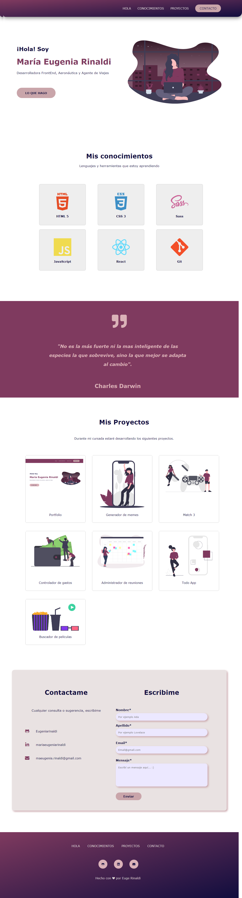

# Portafolio de María Eugenia Rinaldi

### Proyecto realizado para la entrega final del Modulo 1 de la carrera de FrontEnd en Ada

 

### Podes ver como quedó haciendo click en este  [enlace](https://eugeniarinaldi.github.io/Portfolio/) o desde [acá](https://elated-banach-837f42.netlify.app)

### Si queres tener el codigo en tu computadora deberas seguir estos pasos en tu terminal.

 - Ir al [repositorio](https://github.com/Eugeniarinaldi/Portfolio)  
  - darle click al botón de forkear
  - Darle click al botón de code
  - Copiar la url
  - Abrir tu terminal y poner el comando de **git clone <url>**
  - Entrar a la carpeta del proyecto y abrirlo en tu IDE.

  ### Este proyecto no necesita la instalación de ninguna dependencia, por ahora!

 

### Asi debería verse el proyecto

 
 

***

### Un especial agradecimiento para mis profes [John](https://github.com/Jonhks) y [Leydy](https://github.com/leydyk93/) por su ayuda y apoyo de siempre!

#### Hecho con ☕ por Euge Rinaldi

